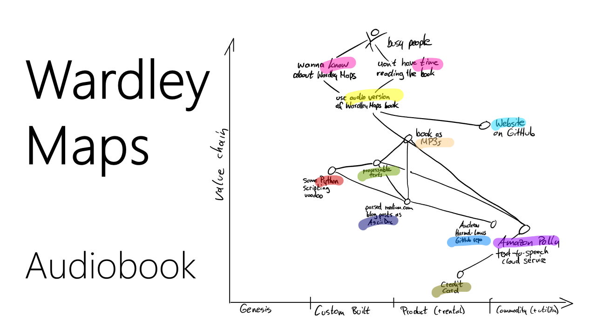

Here you can download and listen to the (synthetically generated) audio version of [Simon Wardley](https://twitter.com/swardley)'s book ["Wardley Maps &ndash; Topographical intelligence in business"](https://medium.com/wardleymaps).

_If you want to find out more about this website (e. g. what headphones, housework and the constant desire to learn have to do with it), check out the [About](./about/) section._

# MP3 (full version)

<a href="https://www.feststelltaste.de/wp-content/uploads/share/Simon%20Wardley%20-%20Wardley%20Maps%20-%20Topographical%20intelligence%20in%20business%20%28complete%20audiobook%29.mp3">Simon Wardley: Wardley Maps - Topographical intelligence in business (complete audiobook, 305 MB)</a>

# MP3s (1 file per section)





<div style="padding-bottom: 10px">
<a href="#{{id | escape}}" name="{{id | escape}}">&nbsp;<i class="fa fa-link"></i></a>&nbsp;&nbsp;<a href="{{ site.baseurl }}{{ mp3.path | escape }}">{{filename}}</a>
This is a hack because there is currently only one speaker. But must be fixed soon.



&nbsp;<a href="{{ speakerfile }}"></a>


</div>





# Human Narrator
In addition to the generated version of the audiobook by Amazon Polly, we're happy to have also a real voice for the audiobook!


**Ben Mosior**  
Principal, Hired Thought <a href="https://twitter.com/HiredThought"><i class="fa fa-twitter"></i></a>

<table style="border:none;">
 <tr>
  <td style="border:none;" width="150px"></td>
  <td style="border:none;" >
  Ben is your friendly methodology whisperer, developing innovative new methods into everyday tools and facilitating learning experiences for teams and communities. Through Hired Thought, Ben shares decision-making and sensemaking approaches oriented around collective knowledge creation. To democratize access to strategic thinking methods, he operates <a href="https://learnwardleymapping.com/">LearnWardleyMapping.com</a> and runs regular events to inform and uplift new practitioners. Ben's goal in work and life is to do his part to enable purposeful systems to flourish. He podcasts for joy and teaches for hope.
  </td>
 </tr>
</table>


# Additional Hints

To download all MP3s from this website, feel free to use this command on your Linux console:

```
wget -c -A '*.mp3' -r -l 1 -nd https://feststelltaste.github.io/wardley-maps-audiobook/
```
_Taken and adopted from <https://askubuntu.com/a/549368>._


# More Information

Here you can find some awesome resources about Wardley Maps: <http://list.wardleymaps.com>



